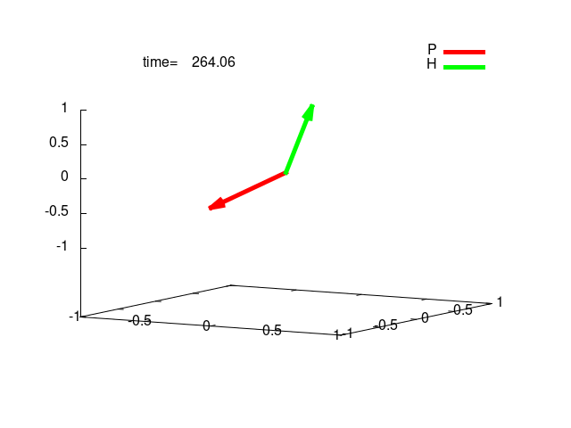

# pendulum model

This program makes the plots of pendulumn, which is used to explain the neutrino oscillation. See the [lecture of Georg G. Raffelt](https://wwwth.mpp.mpg.de/members/raffelt/talks2/Wien/Wien2.pptx) for the details.

## Example

